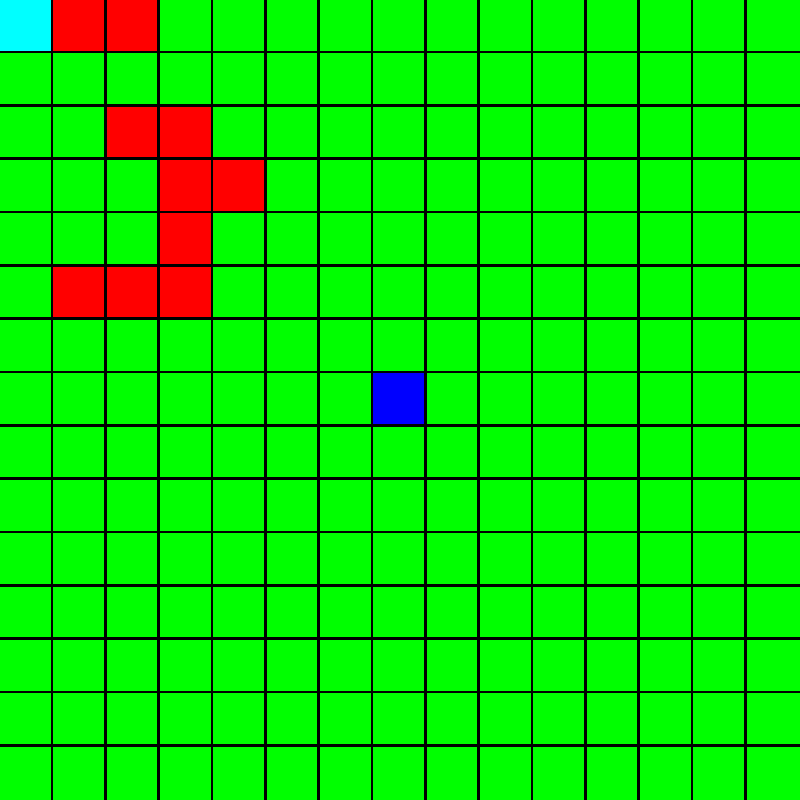

# Алгоритм А*

* Требования: SFML

Эвристики
1. Поиск в глубину
2. Поиск в ширину
3. Евклидова эвристика (обычная евклидова метрика)

Ниже гифка, показывающая работу алгоритма в случае поиска в ширину

